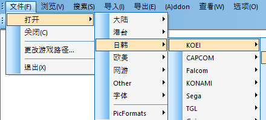
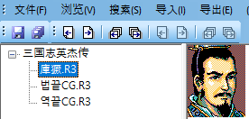
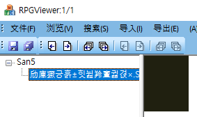
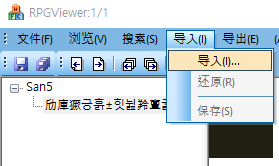
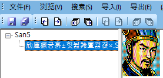
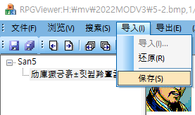
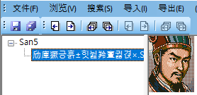
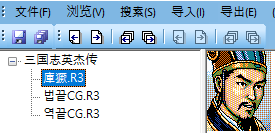

P图.vbs 를 실행하면 RPGViewer가 실행된다.

삼국지5와 영걸전 메뉴 항목은 각각 Koei 항목 밑에서 찾는다.   
경로 지정은 영걸전 mod 에디터의 PATH 디렉터리를 찾아서 지정하면 됨.

영걸전 경로를 PATH에 지정하면 아래와 같은 파일들이 보이고   
얼굴 파일을 클릭하면 첫 번째 장수 이미지가 보인다.   
(각 파일 이름들에 관해서는 아래 주의사항을 참조할 것.)

삼국지5의 경로를 PATH에 지정하면 아래처럼 빈 이미지가 보인다.

여기서 새 이미지를 삽입할 수 있다.

새 이미지를 삽입했다.

교체된 이미지를 저장한다.

저장하면 색상이 다소 변한다. 
이 색상이 그대로 반영되지 않는다.

P图.vbs를 종료하고 MOD 에디터로 나가서
庫獗替换(XX체환, 앞에 두 글자가 다른 이유는 아래 주의사항 참조).vbs를 실행한다.   
창이 나오면 1번을 누르고 실행한다.

다시 P图.vbs 실행하고 영걸전 경로를 지정하면   
1번 장수가 유비에서 제갈량으로 바뀐 결과가 보인다.

庫獗生效(XX생효).vbs가 있는 디렉터리에 영걸전 게임의 얼굴 파일인 FACEDAT.R3를 복사한다.   
庫獗生效.vbs를 실행한다. 1번을 입력하고 확인을 누른다.   
FACEDAT.R3를 영걸전 게임 디렉터리에 복사해서 게임을   
실행해보면 이미지가 교체되어 있을 테다.

## 정리하면

1. 삼국지5의 이미지는 1개 뿐이고 여기에 삽입한 이미지가
새 이미지 파일이 된다.

2. 영걸전의 庫獗(얼굴).R3은 
256개의 얼굴 이미지가 저장된 데이터 파일이다.

3. 庫獗替换.vbs 는 몇 번째 장수 이미지를 새 이미지로 변환할지 묻는다.   
입력한 번호의 장수 이미지를 삼국지5 이미지로 교체한다.   
실행 결과: 庫獗.R3의 데이터가 바뀐다.

4. 庫獗生效.vbs는 몇 번째 장수 이미지를 새 이미지로 생성할지 묻고   
입력한 번호의 장수 이미지를 庫獗.R3의 이미지로 교체한다.   
실행 결과: FACEDAT.R3의 데이터가 바뀐다.

## 주의할 점

MOD 에디터 압축파일을 풀고 나서 중국어로 된 파일명을 변경할 필요가 있다.   
MOD 에디터의 각 파일들을 헥스에디터로 읽어들여 살펴보면   
해당 프로그램이 참조하는 파일 이름이 '뷀어' 혹은 중국어로   
보일 텐데 이것을 외부 파일 명과 일치시켜야 한다.   
위에 세 번째 이미지를 보면 파일 이름을 '뷁어'로 일치시킨 것이 보일 테다.

 -끝-

[영걸전 영상](https://www.youtube.com/watch?v=0x5pqtjtPUs)

